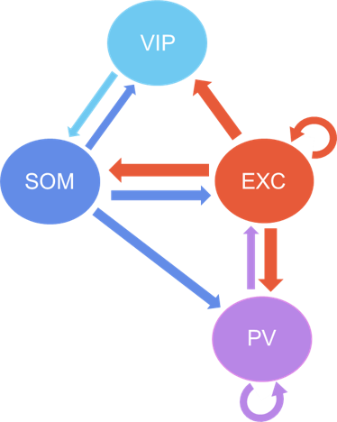

# V1_Mouse_L23_Model
Code to create a spiking model of layer 2/3 of mouse visual cortex and simulate optogenetic perturbation of pattern completion neurons in ensembles

## Background/Motivation
Cortical Ensembles are groups of densely connected neurons that fire together to encode stimuli. [Recent Work](https://www.cell.com/cell/pdf/S0092-8674(19)30616-6.pdf) found preliminary evidence that ensemble activity in layer 2/3 of the mouse visual cortex can drive behavior. However, the link between ensembles and behavior is underdeveloped. Establishing a causal link between ensembles and behavior requires an efficient way to activate ensembles in the absence of stimuli. 

 -- pattern completion neurons

Network Information 

### Code Information
